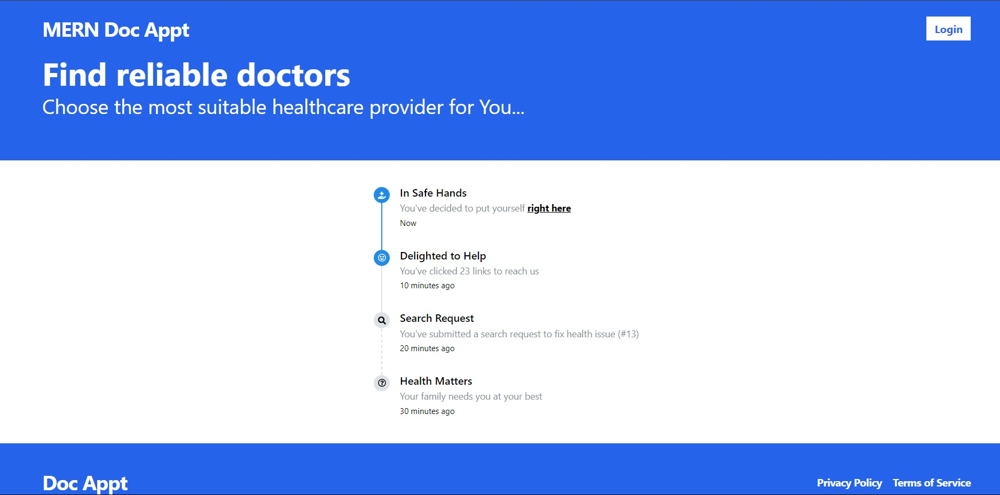
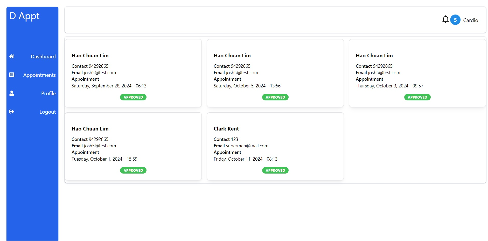

# Developing a Full Stack App - Doctor Appointment

## Project Brief

**MVP**

- Full stack CRUD App with any choice of frontend and backend.
- The back-end and front-end applications implement JWT token-based authentication to sign up, sign in, and sign out users.
- Authorization is implemented across the front-end and back-end. Guest users (those not signed in) should not be able to create, update, or delete data in the application or access functionality allowing those actions.
- The project has at least one data entity in addition to the User model. At least one entity must have a relationship with the User model.
- The project has full CRUD functionality on both the back-end and front-end.
- The front-end application does not hold any secret keys. Public APIs that require secret keys must be accessed from the back-end application.
- The project is deployed online so that the rest of the world can use it.

## Time Frame

1 Week

## Doctors Appointment

Reflecting upon the course, I realized that we had done planning for a doctors appointment booking app twice, and thought it would be a good idea to experience what it would be like doing a similar project as compared to what we had planned out as a rough sketch when we had less concepts about how web applications work.

Check out the deployed app at my [deployed page](https://mern-doctor-appt.onrender.com/).

## Screenshots

## Technologies Used

- MongoDB via mongoose
- Express.js
- React
- Node.js

- Git/Github
- Deployed via [render.com](www.render.com)
- [Bruno](https://www.usebruno.com/) - API Client

List of libraries used can be found in package.json, a mix of Tailwind and Mantine UI was used for styling.

## Using the App

The app is split across 3 categories of users:

- Regular users
- Doctors
- Admin

After logging in, a user can see the list of available doctors and choose one to book an appointment with. After booking an appointment, the doctor will have to login to approve or reject the appointment bookings. You can create a doctor ('s account) by logging in with the following admin credentials

- Email: admin@test.com
- Password: 12345678

Please do not abuse the admin system, this is just for demo purposes.

## Future Development

As this was created for project submission and there is likely a lot more coding and learning to do, I am unsure if there will be further iterations.

Currently the notifications system is barely implemented (only the doctor will receive notifications when a user attempts to make a booking), and toasts are close to but not fully implemented due to running out of development time. There are other ideas as well but they are of lower priority.